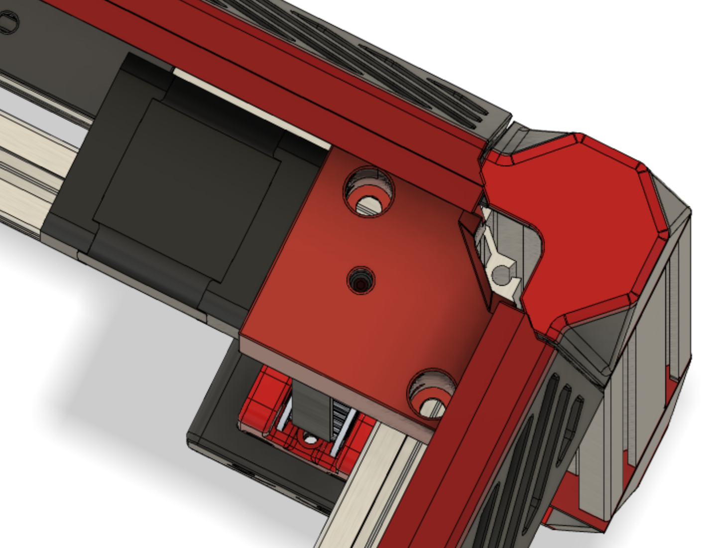
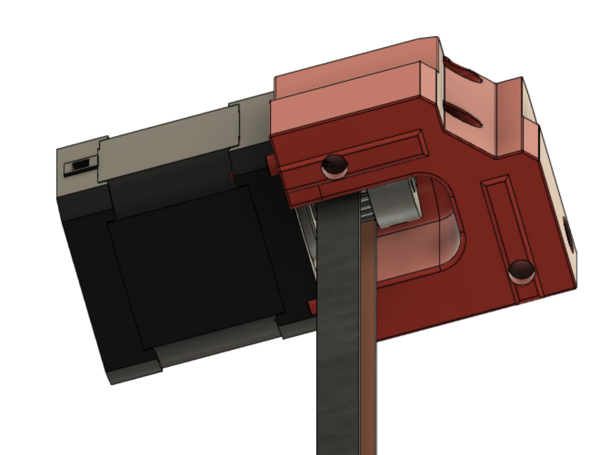
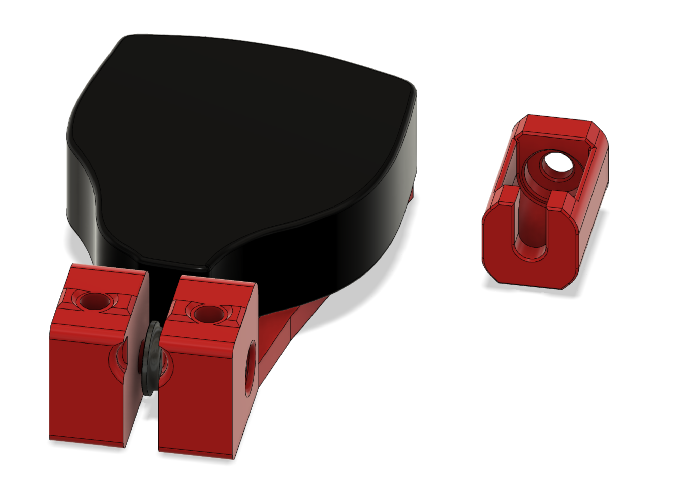

# direct drive z

Based on joshmurrah's direct drive mod for the v2.4 - adapted to DOOM! 

### Notable Features

- reduces required parts and complexity of typical z drive motor units
- slot in the corner of the motor mount to give space for cabling that is passed through the 4040 extrusion frame
- GT2 grub screw access hole
- the key-baks gives a nice combination of jank and ingenuity ;)

 

## Tips

- the space between the motor and the DOOM cubes panel mounting is tight, may want to use m3 bhcs for mounting the panel
mounts to the extrusion
- you'll probably want to have two key-baks on your build; if so, double the amount in the key-bak holder's BOM below

 
## BOM

### direct drive z

---
| part |  notes | quantity | source |
| --- | --- | --- | --- |
| NEMA17 Stepper  | I am using 1.8 deg steppers, .9 deg steppers probably better. | 4 | [Amazon](https://www.amazon.com/STEPPERONLINE-Stepper-Bipolar-Connector-compatible/dp/B00PNEQKC0)|
| GT2 20T 10mm width 5mm bore pulley | if using 6mm belts get the 7mm width version | 4 | [Amazon](https://www.amazon.com/WINSINN-Aluminum-Synchronous-Timing-Printer/dp/B07BT6N12L)  |
| Gates GT2 9mm belts | can use 6mm belts | length depends on build size |  |
| m3x8 shcs  | for mounting motor to mount | 16 |  |
| m5x10 bhcs | for mounting to extrusion | 8 |  |
| m5 roll-in t-nuts | for mounting to extrusion | 8 |  |
---

### key-bak holder

---
| part |  notes | quantity | source |
| --- | --- | --- | --- |
| keybak super48 | the beefy version - 28" Kevlar Cord / 20 oz. Force | 1 | [Amazon](https://www.amazon.com/gp/product/B01CQLJ8I0) |
| 604uu bearing  | key-bak's cord rolls on this | 1 | [Amazon](https://www.amazon.com/HUABAN-4x13x4mm-U-Shaped-Extruder-Bearings/dp/B076D67T6V) |
| m4x20 bhcs or shcs  | for 604uu bearing | 1 |  |
| m5x30 bhcs | for mounting to extrusion | 2 |  |
| m5x10 bhcs | for mounting retainer to extrusion | 1 |  |
| m5 roll-in t-nuts | for mounting retainer and keybak holder to extrusion | 3  |  |
---

