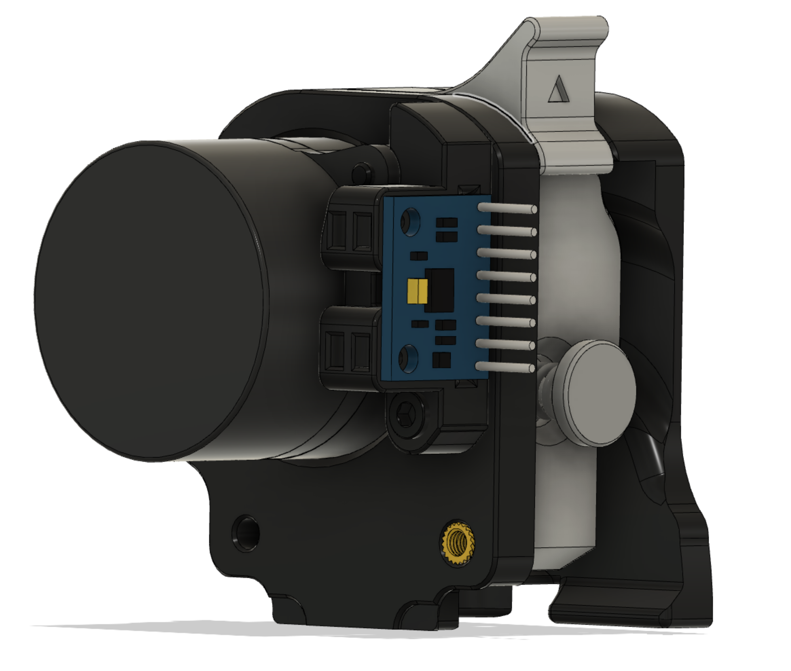

# Galileo ADXL345 Chain Replacement with Umbilical Mount

This mod is an alteration of crag-h4k's mod to replace the chain mount on a Galileo extruder with an adxl345 mount. The original mod can be found [here](https://github.com/FrankenVoron/DoomCube-2/tree/main/Mods/crag-h4k/galileo-adxl345-chain-replacement).

The only thing I did to it, was to add two cutouts that allow two 3mm tie-wraps to be attached to the mount. This can be used to secure an umbilical to the X-carriage.

### Hardware
Part|QTY
:---:|:---:
3x4x5 heatset insert (standard Voron)| 1
3mm tie-wrap|2
