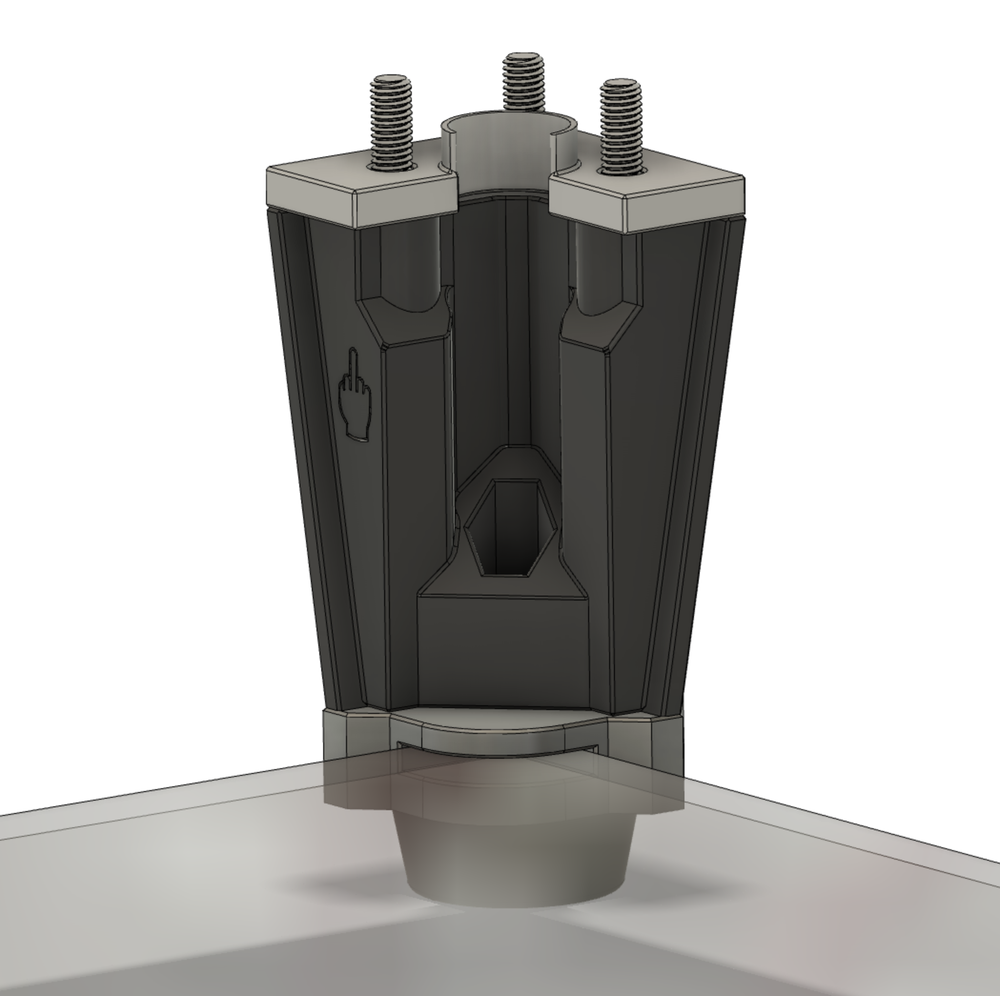

# Corner Panel Mounts

This mod replaces the square feet and the upper and lower corner caps from the original DoomCube.

The feet have been modded so that they each get 2 6x3 round magnets. The corner caps hold 2 magnets as well and they have a slot so they can go around the corners of the top and bottom deck panels. This way the deck panels are magnetically attached to the feet. When a 3mm panel is used, the panels align with the top of the skirts.

The bottom corner cap also has a cutout to hold an m5 hex nut, so the [Misumi Rubber Feet C-30-RK-3215](https://uk.misumi-ec.com/vona2/detail/110500157910/?HissuCode=C-30-RK-3215) can be attached to the corner feet.

### Hardware
Part|QTY
:---:|:---:
6x3mm round magnet (standard Voron)| 32
[Misumi Rubber Feet C-30-RK-3215](https://uk.misumi-ec.com/vona2/detail/110500157910/?HissuCode=C-30-RK-3215)|4
