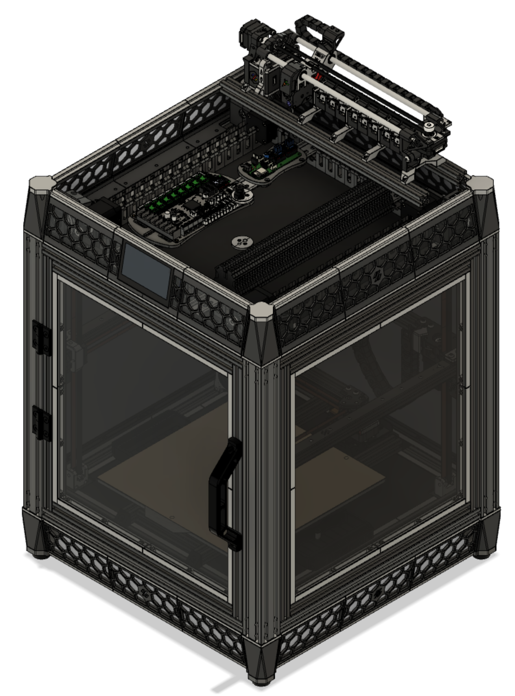
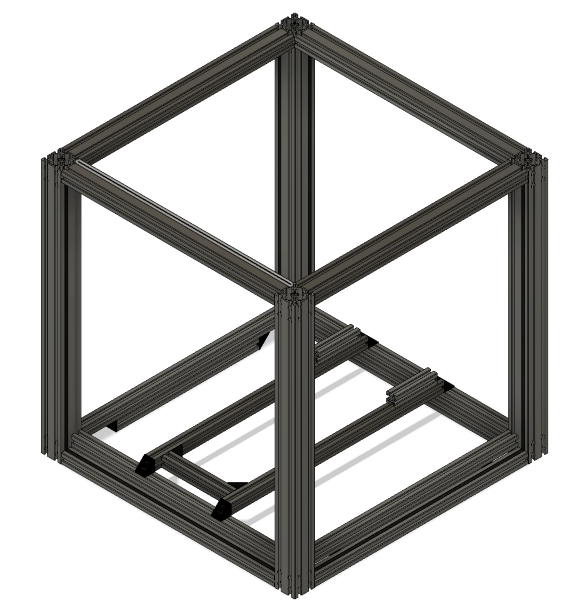
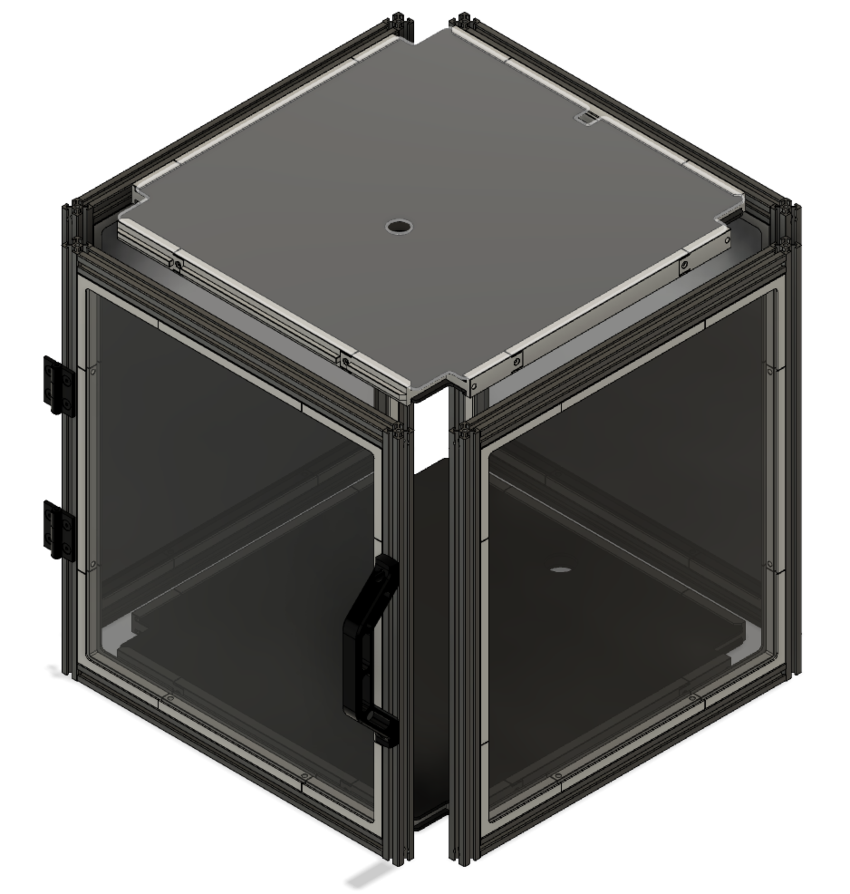
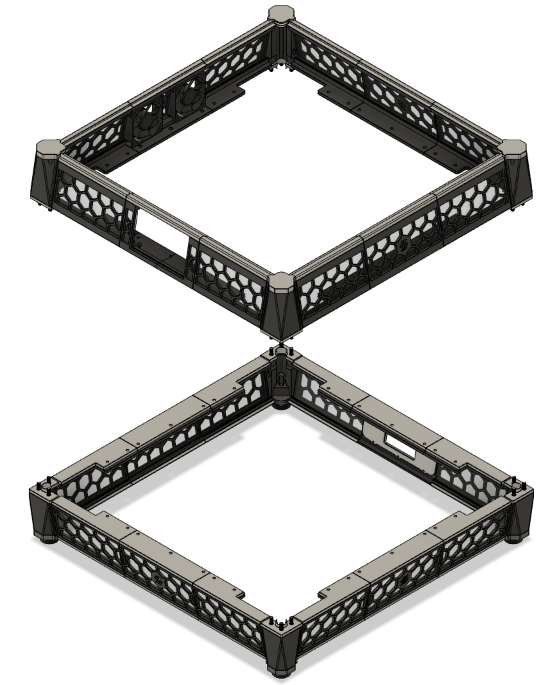
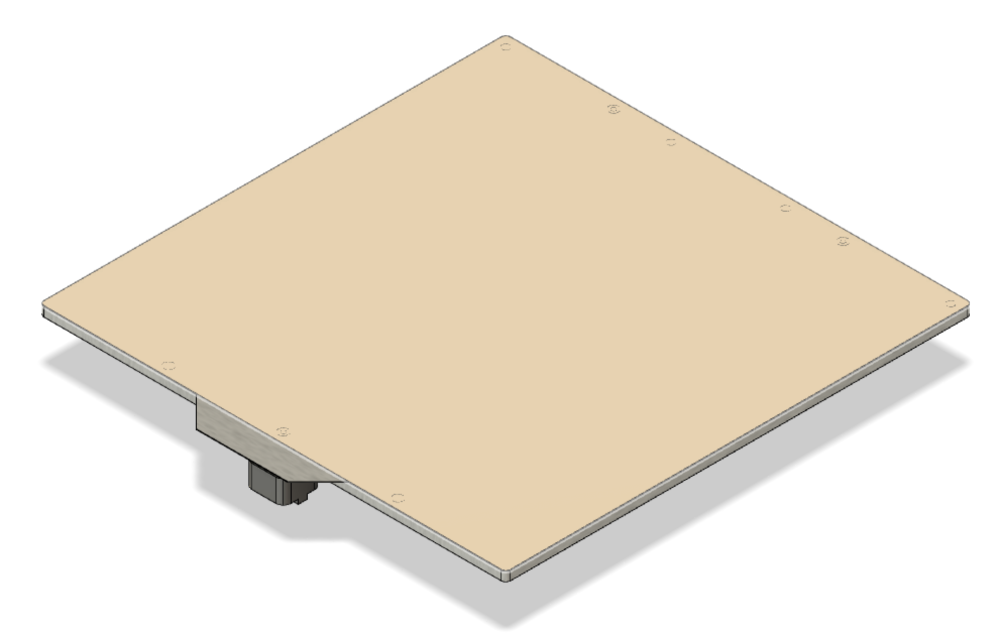
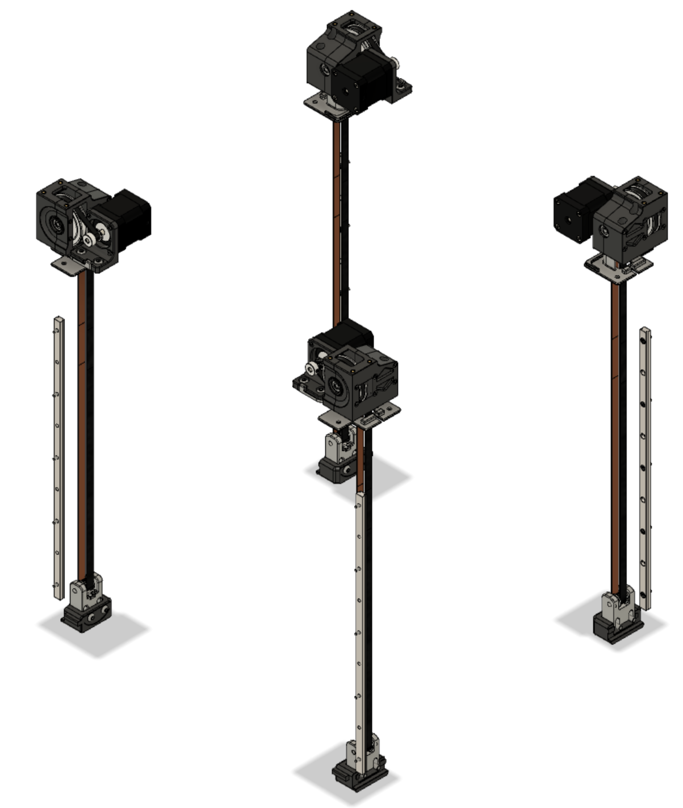
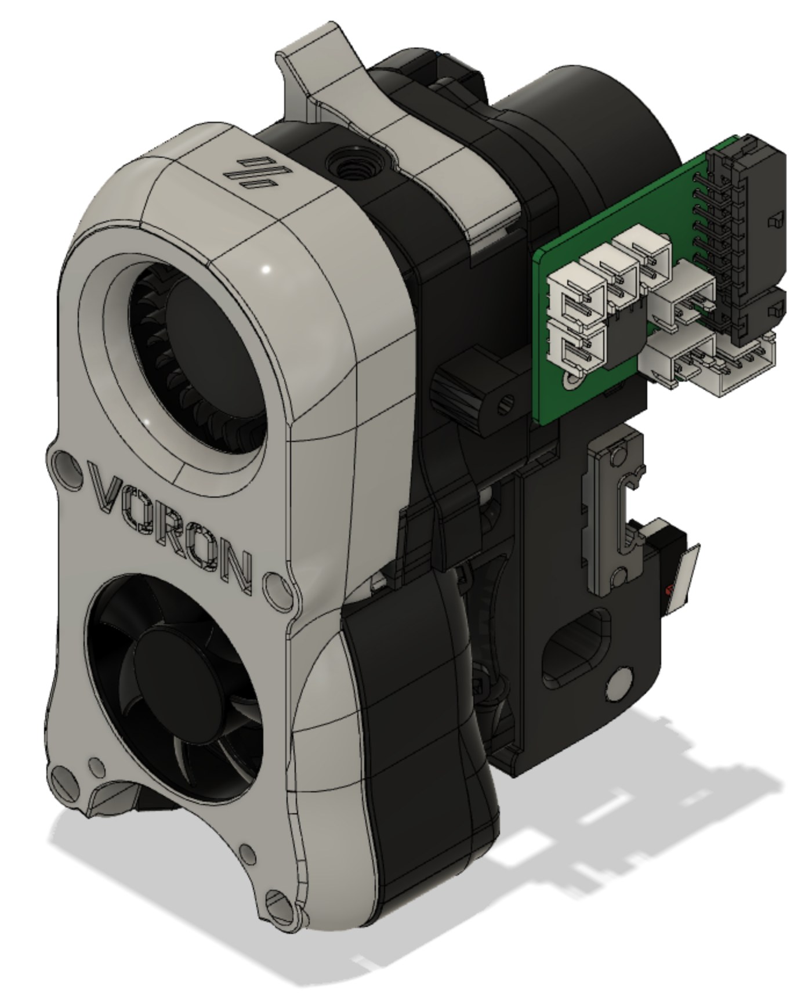
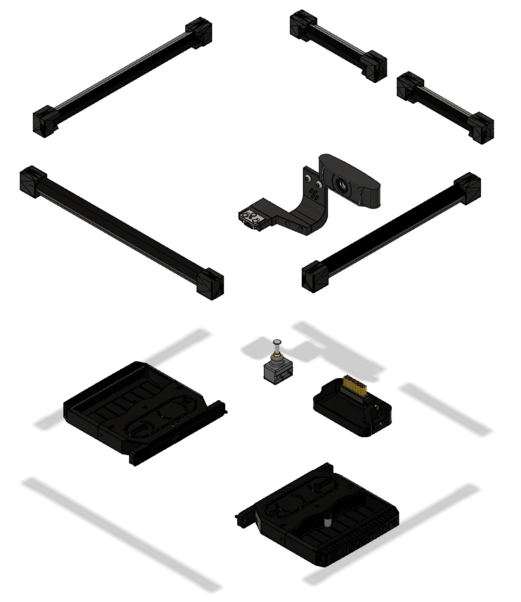
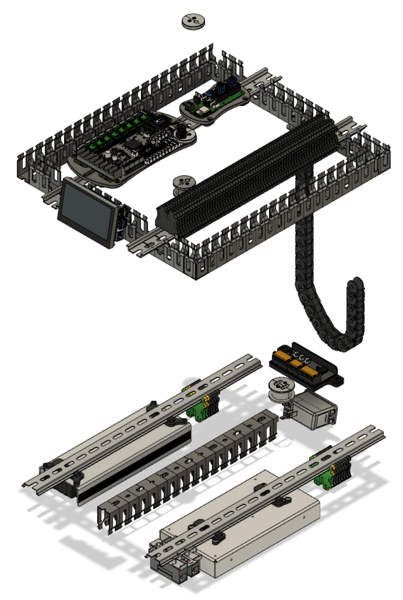
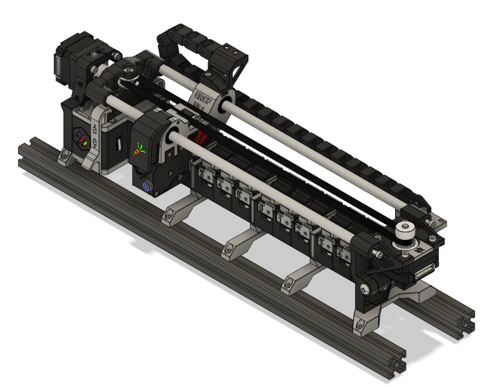

# DoomCube
Based on the DoomCube Mod for the Voron V2 and several popular Mods out there, I decided to capture my personalized DoomCube build in a full CAD.

This repository will list any Mods used that deviate from the regular Voron V2.4 and DoomCube build.

Different types of Mods are used in this build:
- Personal DoomCube modifications. These are the deviations from the original DoomCube files. **Please note: the modifications are specific to this particular build which is a 300m3 build. Be very carefull if you use these files and make sure they can be applied to your situation.** The files will be hosted under this "My DoomCube" Mod. You can find the files under [STL](STL)
- Official Mods. These are official Mods for the Voron V2.4 and DoomCube and are untouched by me and implemented as is. I will link to their official github where you will need to download the files relevant for you.
- Altered DoomCube specific Mods. These are Mods by me based on the official DoomCube files and applicable to any DoomCube build. They will be hosted seperately under the [Mods section of the official DoomCube repository](../..). You will need to download the files from their own mod repository.
- Voron V2 Mods by me. These are Mods by me that are applicable to any Voron V2 (Doomed or not) and will be hosted from my [own Github](https://github.com/mvieleers/Voron-V2) where you can download the files.

**If I don't specify a part, it means that you will need to download the STL from the [Original DoomCube repository](https://github.com/FrankenVoron/DoomCube-2), or in case the part is not listed there as well, from the original [Voron 2 repository](https://github.com/VoronDesign/Voron-2).**

[Make sure to join the DoomCube discord!](https://discord.gg/EAANfEk25f)

## CAD
A full CAD for this build will is available. For the most part it will include fasteners as well, with the exception for flanges, skirts and panelmounts.
As the CAD is 100 Mb+ it cannot be uploaded as one into Github. I've broken it up in different sections (one of these also needed to be zipped). When you import the STEP files into a new drawing, it will form one complete assembly again.

Click [HERE](CAD) for STEP files

## Frame

### Specifics
- 300m3 build.
- I'm using 20mm taller vertical 4040s, so the door, side and back panels all rest within an extrusion frame. This eliminates the need for the flanges to support the panels.
- Instead of 2020's for the top frame, I'm using 4020's.
- Instead of single 2020's for the bottom frame, I'm using double 2020's in the bottom frame in order for the panels to rest on top of the additional 2020 extrusion.
- The bed frame has a cross bar in order to mount my bed with 3 mounting points instead of 4. It is a preparation to add a kinematic bed mounting solution at a later time.

### Hardware
Section|Part| Part #|QTY|Remarks
|:---:|:----:|:----:|:---:|:---:|
Bottom Frame
||Bottom Horizontals|[HFSB5-2020-420-TPW](https://uk.misumi-ec.com/vona2/detail/110302683830/?HissuCode=HFSB5-2020-420-TPW&PNSearch=HFSB5-2020-420-TPW&KWSearch=HFSB5-2020-420-TPW&searchFlow=results2type)|8|Can be reused if you're converting from a standard V2 300
||OpenBuilds Angle Corner Connector|[20x20x20](https://openbuildspartstore.com/black-angle-corner-connector/)|4|Used to keep the two extrusions from rotating
||Slot Covers|[HSCKS5-B](https://uk.misumi-ec.com/vona2/detail/110302695120/?HissuCode=HSCL5-B&searchFlow=results2similartn)|1|Comes in 2m so needs to be cut to length
Vertical Frame
||Square Verticals|[HFSB5-4040-500-LWP-RWP-TPW](https://uk.misumi-ec.com/vona2/detail/110302684530/?HissuCode=HFSB5-4040-500-LWP-RWP-TPW&PNSearch=HFSB5-4040-500-LWP-RWP-TPW&KWSearch=HFSB5-4040-500-LWP-RWP-TPW&searchFlow=results2type)|4
||Slot Covers|[HSCKS5-B](https://uk.misumi-ec.com/vona2/detail/110302695120/?HissuCode=HSCL5-B&searchFlow=results2similartn)|2|Comes in 2m so needs to be cut to length
Top Frame
||Top Horizontals|[HFSB5-2040-420-TPW](https://uk.misumi-ec.com/vona2/detail/110302684350/?HissuCode=HFSB5-2040-420-TPW&PNSearch=HFSB5-2040-420-TPW&KWSearch=HFSB5-2040-420-TPW&searchFlow=results2type)|4
||Slot Covers|[HSCKS5-B](https://uk.misumi-ec.com/vona2/detail/110302695120/?HissuCode=HSCL5-B&searchFlow=results2similartn)|1|Comes in 2m so needs to be cut to length
Bed Frame
|||[HFSB5-2020-420-TPW](https://uk.misumi-ec.com/vona2/detail/110302683830/?HissuCode=HFSB5-2020-420-TPW&PNSearch=HFSB5-2020-420-TPW&KWSearch=HFSB5-2020-420-TPW&searchFlow=results2type)|2|Can be reused if you're converting from a standard V2 300
|||[HFSB5-2020-130](https://uk.misumi-ec.com/vona2/detail/110302683830/?HissuCode=HFSB5-2020-130&PNSearch=HFSB5-2020-130&KWSearch=HFSB5-2020-130&searchFlow=results2type)|1
||OpenBuilds Angle Corner Connector|[20x20x20](https://openbuildspartstore.com/black-angle-corner-connector/)|6|4 for securing the bed frame to the bottom frame, 2 to secure the cross bar. 4 can be reused if you're converting from a standard V2

## Panels

### Specifics
- The principle of the original DoomCube door is applied to the side and back panels, where the panels slide into panelmounts that bolt into the extrusion. KayosMaker has created an awesome [frame generator](https://github.com/FrankenVoron/DoomCube-2/tree/main/Mods/KayosMaker/Toolless%20Panel%20Mod/Panel%20Frame%20Generator%20WORK%20IN%20PROGRESS) to create those panelmounts. His system is a "tip-inn" system so it can be removed without disassembling the frame. In my case, I didn't need it to be removable, so I've used the brackets that slide into the extrusion on two sides and removed the tip-inn parts.
- The slot covers (see frame section) should create a good seal and a tight fit, which should make the panels to securely stay in place. If this is not the case, I have modded the excellent [Annex Engineers Panel Clips for 2020 extrusions](https://github.com/Annex-Engineering/Annex-Engineering_Other_Printer_Mods/tree/master/All_Printers/Annex_Panel_2020_Clips_and_Hinges/panel_clips_and_corners). The Mod involves flattening the clips so it sits flush with the side panel frame. Please take note of the [Annex Engineering EULA](STL/Panels/Panel%20Clips/LICENSE.md)
- Top and bottom panels use [frame generator](https://github.com/FrankenVoron/DoomCube-2/tree/main/Mods/KayosMaker/Toolless%20Panel%20Mod/Panel%20Frame%20Generator%20WORK%20IN%20PROGRESS) by KayosMaker. His system is a "tip-inn" system so it can be removed without disassembling the frame. The "tip-inn" system is still a work in progress and still requires a solution to keep it in place. I didn't need it to be removable (as opposed to the side panels), so I've used the brackets that slide into the extrusion on two sides and removed the tip-inn parts.
- Top and bottom (deck) panels have cutouts for wire passthroughs and the top deck panel has mounting holes for mounting the ERCF on top of the top deck panel.

### Dimensions
Drawings are [here](Drawings), DXFs are [here](DXF)

Panel|Drawing|DXF|QTY
|:---:|:---:|:---:|:---:|
Door|panel_side.pdf|panel_side.dxf|2
Sides|panel_side.pdf|panel_side.dxf|4
Back|panel_back.pdf|panel_side.dxf|2
Top|panel_top.pdf|panel_top.dxf|2
Bottom|panel_bottom.pdf|panel_bottom.dxf|2
Top Deck|panel_top_deck.pdf|panel_top_deck.dxf|1
Bottom Deck|panel_bottom_deck.pdf|panel_bottom_deck.dxf|1

### Printed Parts
Section|Part|STL Origin|QTY
|:---:|:---:|:---:|:---:|
Door / Side / Back Panel Mounts
|Corner|[This Mod](STL/Panels/Sides)|8
|Corner Mirrored|[This Mod](STL/Panels/Sides)|8
|Straight Short|[This Mod](STL/Panels/Sides)|8
|Straight Long|[This Mod](STL/Panels/Sides)|8
|Corner Panel Clips|[This Mod](STL/Panels/Panel%20Clips)|16 (optional)
|Center Panel Clips|[This Mod](STL/Panels/Panel%20Clips)|16 (optional)
|Key for Corner and Center Panel Clips|[Annex Engineering Offical](https://github.com/Annex-Engineering/Annex-Engineering_Other_Printer_Mods/blob/master/All_Printers/Annex_Panel_2020_Clips_and_Hinges/panel_clips_and_corners/key/STL/key_asymmetric_3.STL)|36 (optional)
Top / Bottom Panel
|Straight with Bracket|[This Mod](STL/Panels/Top_Bottom)|4
|Straight without Bracket|[This Mod](STL/Panels/Top_Bottom)|4
|Corner piece 1|[This Mod](STL/Panels/Top_Bottom)|4
|Corner piece 2|[This Mod](STL/Panels/Top_Bottom)|4
|Corner piece 1 mirrored|[This Mod](STL/Panels/Top_Bottom)|4
|Corner piece 2 mirrored|[This Mod](STL/Panels/Top_Bottom)|4

### Hardware
Hardware|Part|QTY|Remarks
|:---:|:---:|:---:|:---:
Vertical extrusions|[HFSB5-2020-458-LCH-RCH](https://uk.misumi-ec.com/vona2/detail/110302683830/?HissuCode=HFSB5-2020-458-LCH-RCH)|8
Horizontal extrusions|[HFSB5-2020-378-TPW](https://uk.misumi-ec.com/vona2/detail/110302683830/?HissuCode=HFSB5-2020-378-TPW)|8
Handle|[Aluminum Alloy Door Handle](https://nl.aliexpress.com/item/1407596513.html?spm=a2g0s.9042311.0.0.66fb4c4deTZEmA)|1|CAD shows printed door handle, I use this type of aluminum handle in size 120mm (ordered without screws and nuts)
Hinge|[HHPBSN5-SET](https://uk.misumi-ec.com/vona2/detail/110302362010/?HissuCode=HHPBSN5-SET&PNSearch=HHPBSN5-SET&KWSearch=HHPBSN5-SET&searchFlow=results2type)|2

## Skirts

### Specifics
- Basis is the hexagon skirts from the original DoomCube. 
- Due to side and back panel mounting system, flanges of the door are used all around as well as the panelmounts.
- Panelmounts are 2 pieces per side, instead of 3. This might not be printable on smaller bed sizes.
- Top and Bottom have altered top caps for the corners. These caps allow the deck panels to be attached to the corners with magnets.
- Top corners and skirts have been increased in size in order to accomodate my Waveshare 4,3" LCD. For this a center skirt was modded to hold the LCD.

### Dimensions
Drawings are [here](Drawings), DXFs are [here](DXF)

Panel|Drawing|DXF|QTY
|:---:|:---:|:---:|:---:|
Bottom Center Skirt Panel|skirt_bottom_center.pdf|skirt_bottom_center.dxf|3
Bottom Side Skirt Panel|skirt_bottom_side.pdf|skirt_bottom_side.dxf|8
Top Center Skirt Panel|skirt_top_center.pdf|skirt_top_center.dxf|3
Top Side Skirt Panel|skirt_top_side.pdf|skirt_top_side.dxf|8
Top LCD Skirt Panel|skirt_top_lcd.pdf|skirt_top_lcd.dxf|2

### Printed Parts
Section|Part|STL Origin|QTY
|:---:|:---:|:---:|:---:|
Square Corners Foot
||Bottom Corner|[Corner Panel Mounts](../corner_panel_mounts/STL)|4
||Top Corner|[This Mod](STL/Skirts/Corners/Top)|4
||Foot Mount (to extrusion)|[Original](../../../STLs/Corners/Square%20Extrusions)|8
||Bottom Corner Cap (panel mount)|[Corner Panel Mounts](../corner_panel_mounts/STL)|4
||Top Corner Cap (panel mount)|[This Mod](STL/Skirts/Corners/Top)|4
Skirts
||Bottom Center Skirt|[Original](https://github.com/FrankenVoron/DoomCube-2/tree/main/STLs/Skirts/Hexagon%20Skirts)|3
||Bottom Left Side Skirt|[Original](https://github.com/FrankenVoron/DoomCube-2/tree/main/STLs/Skirts/Hexagon%20Skirts/300)|4
||Bottom Right Side Skirt|[Original](https://github.com/FrankenVoron/DoomCube-2/tree/main/STLs/Skirts/Hexagon%20Skirts/300)|4
||Bottom Power Inlet Skirt|[Original](https://github.com/FrankenVoron/DoomCube-2/tree/main/STLs/Skirts)|1
||Bottom Power Inlet Skirt Inlay|[FN-286 Plug Panel](../fn-286_plug_panel)|1
||Top Center Skirt|[This Mod](STL/Skirts/Skirts/Top)|3
||Top Left Side Skirt|[This Mod](STL/Skirts/Skirts/Top)|4
||Top Right Side Skirt|[This Mod](STL/Skirts/Skirts/Top)|4
||Top LCD Skirt|[This Mod](STL/Skirts/Skirts/Top)|1
Flanges
||Center Flange|[Original DoomCube Door Center Flange](https://github.com/FrankenVoron/DoomCube-2/tree/main/STLs/Door/Flanges)|8
||Side Flange|[Original DoomCube Door Side Flange](https://github.com/FrankenVoron/DoomCube-2/tree/main/STLs/Door/Flanges)|16
Skirt Accents
||Center Skirt Accent|[Original](https://github.com/FrankenVoron/DoomCube-2/tree/main/STLs/Skirts/Hexagon%20Skirts)|7
||Left Side Skirt Accent|[Original](https://github.com/FrankenVoron/DoomCube-2/tree/main/STLs/Skirts/Hexagon%20Skirts/300)|8
||Right Side Skirt Accent|[Original](https://github.com/FrankenVoron/DoomCube-2/tree/main/STLs/Skirts/Hexagon%20Skirts/300)|8

### Hardware
Hardware|Part|QTY|Remarks
|:---:|:---:|:---:|:---:
4.3" LCD|[Waveshare 4.3" LCD DSI](https://www.waveshare.com/4.3inch-dsi-lcd.htm)|1|The Raspberry Pi can be screwed to the LCD screen
Power Inlet|[Schaffner FN-286](https://www.digikey.nl/product-detail/en/schaffner-emc-inc/FN286-1-06/817-1928-ND/1997125?utm_adgroup=Power%20Entry%20Connectors%20-%20Inlets%2C%20Outlets%2C%20Modules&utm_source=google&utm_medium=cpc&utm_campaign=Shopping_Product_Connectors%2C%20Interconnects&utm_term=&productid=1997125&gclid=CjwKCAjw7fuJBhBdEiwA2lLMYTt-iqS_a8Cr28pWmyBAhIXpcLJp1rsu5ffDzC7lFXPegO6_Ck0uYBoCgaoQAvD_BwE)|1

## Heated Bed

### Specifics
- Mandela Rose Works ultra flat bed is used. It has mounting holes for both the V1.8 and the V2.4. Therefor I'm able to use a triangle 3-point mounting method, by inserting a cross bar between the two bed extrusions. This is also done to accomodate for a kinematic mounting system that is in development with Mandela Rose Works and uses 3 mounting points.
- When not using a kinematic mounting solution, you will only need 3 of the original knurled knuts

### Hardware
Hardware|Part|QTY|Remarks
|:---:|:---:|:---:|:---:
Mic6 Bed|[Mandala Rose Works Ultra Flat Bed](https://www.mandalaroseworks.com/shop/voron/voron-300-standard-bed)|1|
Heater|[Keenovo 240x240 600W 220V](https://keenovo.store/collections/standard-keenovo-silicone-heaters/products/keenovo-square-silicone-heater-3d-printer-build-plate-heatbed-heating-pad?variant=8324020961335)|1
Magnetic Sheet|[Graviflex 310x310](https://fermio.xyz/en/mechanical/magnetic-sheets/121/magnetic-sheet-310x310x1mm)|1|
Spring Steel Plate|[300x300 Spring Steel Plate](https://www.vonwange.com/product/300x300mm-1-4310-spring-steel-plate/)|1|
PEI Sheet|[Buildtak 12x12" PEI](https://www.buildtak.com/product/buildtak-3d-printing-surface-pei/)|1|
Knurled Nuts|Voron Standard Knurled Nuts|3|

## Z-Assembly

### Specifics
- Z-Drives are completely original DoomCube
- Motor Mounts are taken from the DoomCube CAD, there are no stl's for this in the repository which implies to use the original V2.4 parts. Those have 3 mounting points though, I like the 4 mounting points better, so I created the stl from the DoomCube CAD.
- The belt covers are modded from the original non-reflectix belt covers, I just added a somewhat different ledge to make a tighter integration to the panels.
- I'm using the 9mm pinned Z-Idlers

Section|Part|STL Origin|QTY
|:---:|:---:|:---:|:---:|
Z-Drive
||Z-Drive Main|[Original](https://github.com/FrankenVoron/DoomCube-2/tree/main/STLs/Z_Drives)|2 standard, 2 mirrored
||Z-Drive Retainer|[Original](https://github.com/FrankenVoron/DoomCube-2/tree/main/STLs/Z_Drives)|2 standard, 2 mirrored
Motor Mount
||Motor Mount|[This Mod](STL/Z-Assembly/Z-Drives)|2 standard, 2 mirrored
Z-Idler
||Belt Tensioner 9mm pinned|[Original](https://github.com/mvieleers/DoomCube-2/tree/main/STLs/Z_Idlers)|4
||Tensioner bracket|[Original](https://github.com/mvieleers/DoomCube-2/tree/main/STLs/Z_Idlers)|2 standard, 2 mirrored
Belt Cover
|| Belt Cover|[This Mod](STL/Z-Assembly/Belt%20Covers)|2 standard, 2 mirrored

## Gantry

### Specifics
The Gantry is a combination of several official Mods. Take good care to select the correct versions from each Mod so they work together.
**Due to using the MGN12 mod in combination with the Gantry Backing Plates Mod and the Y Endstop Relocation Mod, the Y-endstop will trigger to soon due to the added backer. Therefor I've included a modded upper part for the A-drive with the Y endstop mounting point 3mm recessed.**
|Mod|Creator|
|:---:|:---:|
|[MGN12 X axis](https://github.com/VoronDesign/VoronUsers/tree/master/printer_mods/arkeet/mgn12)|arkeet
|[Pins Mod](https://github.com/VoronDesign/VoronUsers/tree/master/printer_mods/hartk1213/Voron2.4_Pins_Mod)|hartk1213
|[Y Endstop Relocation](https://github.com/VoronDesign/VoronUsers/tree/master/printer_mods/hartk1213/Voron2.4_Y_Endstop_Relocation)|hartk1213
|[Upper part A-drive (pinned with Y-endstop 3mm recessed)](STL/Gantry/AB_Drive_Units)|mvieleers
|[GE5C](https://github.com/hartk1213/MISC/tree/main/Voron%20Mods/Voron%202/2.4/Voron2.4_GE5C/STLs)|hartk1213
|[Gantry Backing Plates](https://github.com/VoronDesign/VoronUsers/tree/master/printer_mods/whoppingpochard/extrusion_backers)|whoppingpochard
|[lil a drive cable cover](https://github.com/mvieleers/DoomCube-2/tree/main/Mods/crag-h4k/lil-a-drive-cable-cover)|crag-h4k

### Hardware
There are no deviations from the standard Voron V2 in terms of extrusions.

## X-Carriage

### Specifics
Like the Gantry, the X-Carriage is a combination of several official Mods. Again, take good care to select the correct STL's that work with your setup.
|Mod|Creator|
|:---:|:---:|
|[BlueDragonX's Klicky Mods-Voron 2.4 Direct Mount MGN12 X Carriage](https://github.com/jlas1/Klicky-Probe/tree/main/Usermods/bluedragonx)|bluedragonx
|[Galileo Clockwork](https://github.com/JaredC01/Galileo)|JaredC01
|[AB-BN-30](https://github.com/VoronDesign/VoronUsers/tree/master/printer_mods/Badnoob/AB-BN)|Badnoob
|[Simple mount for Hartk board for galileo.](https://github.com/VoronDesign/VoronUsers/tree/master/printer_mods/Majarspeed/Hartk_Mount_Galileo)|Majarspeed
|[Afterburner Toolhead Board - ERCF version](https://github.com/hartk1213/MISC/tree/main/PCBs/Afterburner_Toolhead_PCB)|hartk1213
[Galileo ADXL345 Chain Replacement with Umbilical Mount](../adxl_mount_w_umbilical)|mvieleers

### Printed Parts
The CAD contains the Galileo Clockwork body. In reality I am using the non-released version of the ERCF 1.1 filament sensor which replaces the Galileo Clockwork body. This STL circulates in the Enraged Rabbit Channel on Discord, but as it is not officially released, I will not provide it in this repository yet. It will be released together with the new ERCF 1.1 version. Please keep an eye out on the official and amazing [Enraged Rabbit Project](https://github.com/EtteGit/EnragedRabbitProject) for more information.
 
### Hardware
I'm using a Mosquito Standard Flow hotend.

## Other

### Specifics
This section contains several additional Mods to complete the setup within the chamber
|Mod|Creator|
|:---:|:---:|
|[SexBolt Z endstop](https://github.com/hartk1213/MISC/tree/main/Voron%20Mods/Voron%202/2.4/Voron2.4_SexBolt_ZEndstop)|hartk1213
|[Klicky-Probe](https://github.com/jlas1/Klicky-Probe)|jlas1 a.k.a. JosAr
|[Purge brush bucket](https://github.com/Annex-Engineering/Annex-Engineering_Other_Printer_Mods/tree/master/All_Printers/Purge_Brush_Bucket)|Annex Engineering
|[Nevermore Micro V5 Duo](https://github.com/0ndsk4/VoronUsers/tree/0ndsk4/printer_mods/0ndsk4/Nevermore_Air_Filter/Nevermore_Micro)|0ndsk4
|[Angry Led Mount](https://github.com/VoronDesign/VoronUsers/tree/master/printer_mods/42bios/LED_mount)|42bios
|[USB Camera Mount](https://github.com/VoronDesign/VoronUsers/tree/master/printer_mods/Takuya/USBCameraMount)|Takuya

### Hardware
Hardware|Part|QTY|Remarks
|:---:|:---:|:---:|:---:
Led Bar|[LumenTEC LT3 Profile](https://lumentec.eu/Aluminium-Eckig-LED-Profil-100cm-45-fuer-8-12mm-LED-Streifen-Profil-LT3-Abdeckung)|2|
USB Camera|[Wansview 1080p Webcam](https://www.wansview.com/cn/proinfo.aspx?proid=37&categoryid=3&aids=1)|1

## Electronics

### Specifics
- I'm using 5 wire grommets for the passthrough of wires and the reverse bowden tube through the panels. The wire grommets are specific to this build, however the initial idea and credit goes to LoCoCNC's [Wire Grommet Mod](https://github.com/VoronDesign/VoronUsers/tree/master/printer_mods/LoCoCNC/wire_grommets).
  - Wire grommet for passthrough of Tircowns ERCF easy board to the ERCF
  - PTFE grommet for passthrough of PTFE from top deck panel to top panel
  - PTFE and Umbilical grommet for passthrough of PTFE and Wires to the toolhead
  - Wire grommet for the Z-chain wires
  - Wire grommet for the wires trough the bottom panel to the bottom of the chamber
- The Z-chain uses the original Voron V2.4 mounting brackets, they are simply reversed to run it from the top to the A drive
- I'm using a Raspberry Pi 4b, directly attached to the Waveshare 4.3" LCD screen, the BTT Octopus v1.1 and Tircown's ERCF Easy Board. I use TMC 2209 as stepper driver for everything.
- In the chamber, to tidy up the wiring under and behind the heated bed, I'm using a PCB as a central connection point.
- As the standard DoomCube was envisioned, I have my PSU and SSR on the underside and the controller boards in the top compartiment. This way high and low voltage are seperated and you have easy access to the controller boards.
- All electronics in the lower and upper compartment are placed on DIN rails so I never need to change holes in the panels to mount them. The DIN Rails are not screwed to the panel (like on the Voron V2.4, but are attached with screws (on top of the skirts base) to the extrusion.
- I use Phoenix UT 2,5 terminal blocks for wire management, this is optional.

|Mod|Creator|
|:---:|:---:|
[Heated Bed PCB](https://github.com/mvieleers/Voron-V2/tree/main/PCB/Heated%20Bed)|mvieleers
[V2_Octopus_Mount](https://github.com/walttriano/V2_Octopus_Mount)|walttriano
[ERCF Easy Board Mount](https://github.com/Tircown/ERCF-easy-brd/tree/main/mods/DIN%20mount)|mvieleers

### Printed Parts
Part|STL Origin|QTY
|:---:|:---:|:---:|
ERCF Wire Grommet (4 parts)|[This Mod](STL/Electronics/Grommets)
PTFE Wire Grommet(4 parts)|[This Mod](STL/Electronics/Grommets)
PTFE and Umbilical Grommet (4 parts)|[This Mod](STL/Electronics/Grommets)
Z-Chain Grommet (4 parts)|[This Mod](STL/Electronics/Grommets)
Heated Bed Grommet (4 parts)|[This Mod](STL/Electronics/Grommets)

### Hardware
Hardware|Part|QTY|Remarks
|:---:|:---:|:---:|:---:
Controllers
||[Raspberry Pi 4b](https://www.raspberrypi.org/products/raspberry-pi-4-model-b/)|1|
||[BTT Octopus v1.1 with TMC 2209](https://nl.aliexpress.com/item/1005002613363656.html?src=google&src=google&memo1=freelisting&albch=shopping&acnt=494-037-6276&slnk=&plac=&mtctp=&albbt=Google_7_shopping&albagn=888888&isSmbAutoCall=false&needSmbHouyi=false&albcp=12556492032&albag=121061693882&trgt=539263010115&crea=nl1005002613363656&netw=u&device=c&albpg=539263010115&albpd=nl1005002613363656&gclid=Cj0KCQjw1ouKBhC5ARIsAHXNMI8LQxuAfiyGBFZ4bwXYRCNFwvKxnK1mLZ_Ikdjdyy8XdzH4IvoiVgwaApkEEALw_wcB&gclsrc=aw.ds&aff_fcid=e4fe000105fb4420a747a0448c6bc5c5-1631806215370-09135-UneMJZVf&aff_fsk=UneMJZVf&aff_platform=aaf&sk=UneMJZVf&aff_trace_key=e4fe000105fb4420a747a0448c6bc5c5-1631806215370-09135-UneMJZVf&terminal_id=15a09c656a8543e3bfa63f7b2fc963c2)|1|
||[Tircown's ERCF Easy Board with TMC 2209](https://github.com/Tircown/ERCF-easy-brd)|1|
4.3" LCD|[Waveshare 4.3" LCD DSI](https://www.waveshare.com/4.3inch-dsi-lcd.htm)|1|The Raspberry Pi can be screwed to the LCD screen
Power Inlet|[Schaffner FN-286](https://www.digikey.nl/product-detail/en/schaffner-emc-inc/FN286-1-06/817-1928-ND/1997125?utm_adgroup=Power%20Entry%20Connectors%20-%20Inlets%2C%20Outlets%2C%20Modules&utm_source=google&utm_medium=cpc&utm_campaign=Shopping_Product_Connectors%2C%20Interconnects&utm_term=&productid=1997125&gclid=CjwKCAjw7fuJBhBdEiwA2lLMYTt-iqS_a8Cr28pWmyBAhIXpcLJp1rsu5ffDzC7lFXPegO6_Ck0uYBoCgaoQAvD_BwE)|1
PSU|[Meanwell LRS-200-24](https://www.digikey.nl/product-detail/en/mean-well-usa-inc/LRS-200-24/1866-3332-ND/7705026?utm_adgroup=AC%20DC%20Converters&utm_source=google&utm_medium=cpc&utm_campaign=Shopping_Product_Power%20Supplies%20-%20External%2FInternal%20%28Off-Board%29&utm_term=&productid=7705026&gclid=Cj0KCQjw1ouKBhC5ARIsAHXNMI8A3oB3rzFBTurlmHVQ8Iba5ArECfS3tNMoFBuKY0rHg7v0oA5mFFcaAulAEALw_wcB)|1|
SSR|[Omron G3NA](https://industrial.omron.nl/nl/products/G3NA-210B-UTU-5-24VDC)|1|
DIN Mount for SSR|[Omron G3NA DIN Rail Mount](https://nl.rs-online.com/web/p/relay-sockets/8278478/?cm_mmc=NL-PLA-DS3A-_-google-_-PLA_NL_NL_Relays_Whoop-_-(NL:Whoop!)+Relay+Sockets-_-8278478&matchtype=&pla-342943934088&gclid=CjwKCAiAhbeCBhBcEiwAkv2cY1hHD5bc5jkEDy0bZmEPV22O3sgnhxs_zoto_doTzER4sUxc0jh88xoCXFgQAvD_BwE&gclsrc=aw.ds)|1|
Terminal Blocks|[Phoenix Contact UT2,5](https://www.phoenixcontact.com/online/portal/nl/pxc/product_list_pages/!ut/p/z1/xVTfT9swEP5beMij43PjpOYxVBOIAQN1gyYvke04rVnipI7bAH_9nG0vlSDVhKr5wb6Tvvvul-9wjlc4N3yv19zp1vDa61meFGz2dXF1ScktkPsYHi6WC3bxbf7IUoIfcY7zTuoSZ1VZKjaLACWMRIhKViFeAkEllTSmVcRFwke0NK5zG5yZ2tQBDEoE0HBtAuhsW-6k6wOode-Kjq-VlyulSuQ2tt2tN4VTttE-sELUrfzZFx0iMfI-YObvAAQDxeMKEJlVAlGhCDrnEUOkOgfJBY8oMPw0mdNljPPplP_YwwcnhWP2mbeffwh4iPHTXqsB_zCtbXwLlv9Y4Ss45mH-SQ_T9Ak9Kf3tielPW5wvyWnpPxv99bHP6xeCft5u89TPcWucenF49f8GOZ8Mdxzl34CJWV2auri7Ke5Xi7ubYx87_lvOFxl23PImHBOzoVXbneqdKkPbDqFsd8bhjMAhtG-tC0ttlRw3K87S5eI9rl7VHuGpRhVn9B2SSqvat3OUD6uGu6Zh0atG2fV-GL5XzUKww-c1gmfKxZsSb2l6dvYLLIAPAw!!/p0/IZ7_82KCHG41M01P50QBSC8BO7V865=CZ6_82KCHG41M01P50QBSC8BO7V8A1=MEpxc.param.sort.direction!ASC=pxc.param.pager.requested.row.count!10=pxc.param.pager.selected.page!1=pxc.param.sort.field!sort_p-15-01-02-01==/#Z7_82KCHG41M01P50QBSC8BO7V865)|As much as you need|Several accessoires available

## Enraged Rabbit Carrot Feeder

The ERCF is completely stock please refer to the amazing [Enraged Rabbit Project Github](https://github.com/EtteGit/EnragedRabbitProject) by EtteGit.

### Specifics
 - 12 Channel ERCF. Number of channels is irrelevant as I mount the ERCF to the extrusion and the extrusion is mounted to the top deck panel.

### Hardware
For mounting the frame to the Top Deck Panel you will need the following hardware:

Part|QTY
|:---:|:---:|
|[HFSB-2020-420](https://uk.misumi-ec.com/vona2/detail/110302683830/?HissuCode=HFSB5-2020-420&PNSearch=HFSB5-2020-420&KWSearch=HFSB5-2020-420&searchFlow=results2type)|2
|M5x10 BHCS|6|
|M3x8 SHCS|10|

#### A big thanks to all original creators for all their hard work to create all the Mods that were used in this DoomCube build. Always follow the links to their respective repos for the latest stls, and info on how to best make use of their mods.
